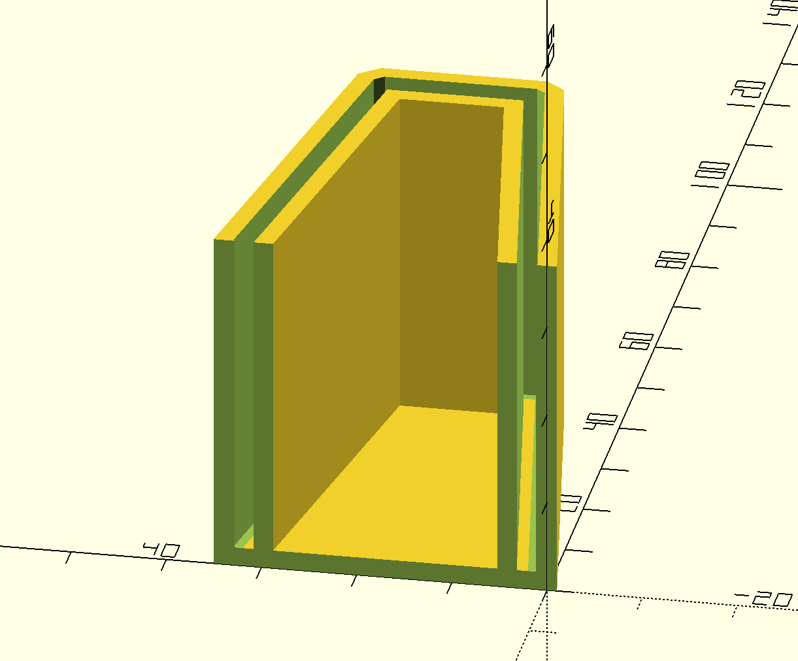
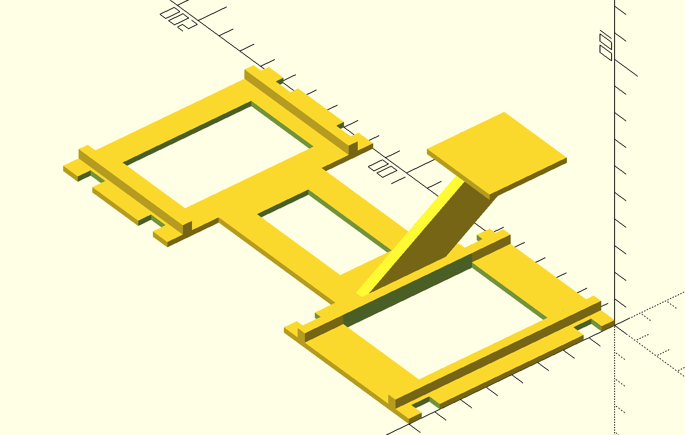

Garage sensor mount
===================

Requirements
------------

Fixed:
- Pi zero case dimensions: 79mm x 38mm x 15mm
- Rail width: 60mm
- Rail mount dimensions: 55mm x 55mm

Moving:
- Door cross bar
    - Trapezoid cross section
    - ~30mm high at door
    - ~10mm high at inside
    - ~43mm deep
    - ~1mm thick

Gap:
- Cross bar and rail separation: ~30mm

Design
------

- Socket cover for the door cross bar, flat mount for the door sensor
- Structured flat mount across the rail, flat mount for the pi, and for the fixed sensor

Parts
-----

Door socket mount: `DoorSensor.scad`

Fixed Pi mount: `PiSensorMount.scad`

Process
-------

1. Manually design as an OpenSCAD file: `foo.scad`
    - Edit in any text editor or OpenSCAD
2. Rendered to PNG (via OpenSCAD): `make foo.png`
3. Rendered to STL (via OpenSCAD): `make foo.stl`
4. Manually slice (in Slic3r): `foo.gcode`
5. Print on Ender 5 Pro
6. Repeat 1-5 until it fits
